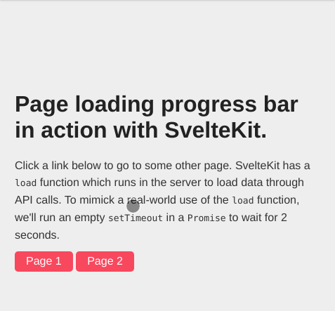

# sveltekit-page-progress-demo

This is a demo of YouTube-like page loading progress bar done with SvelteKit. See the [demo here](https://sveltekit-progress.vercel.app/). To know the details, refer to this [blog post](https://dev.to/TOBEEDITED).

## GIF Demo

